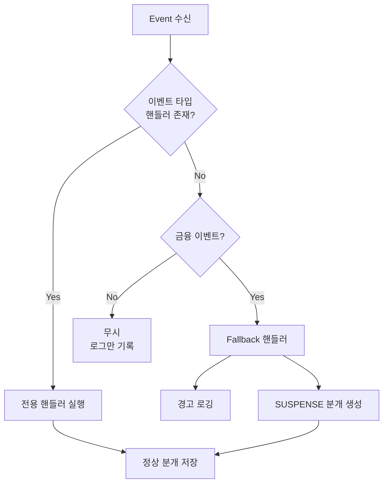

# 복식부기 시스템 도입 가이드

**버전**: 1.2  
**작성일**: 2026-02-21  
**최종 수정**: 2026-02-21  
**목적**: AlphaEngine에 복식부기(Double-Entry Bookkeeping) 시스템 도입

**v1.2 변경사항**:
- USDT 환산 기반 균형 검증 추가 (섹션 14)
- JournalLine에 `asset`, `usdt_value`, `usdt_rate` 필드 필수화
- `_get_usdt_rate()` 환율 조회 헬퍼 메서드 추가
- 모든 핸들러에 USDT 환산 로직 적용

**v1.1 변경사항**:
- 동적 Asset 계정 자동 생성 메커니즘 추가 (섹션 15.1)
- Fallback Handler를 통한 알 수 없는 거래 타입 처리 (섹션 15.2)
- SUSPENSE 계정 모니터링 및 정리 절차 (섹션 15.3)
- TransactionType에 UNKNOWN, ADJUSTMENT, CORRECTION, OTHER 추가
- 초기 계정에 EQUITY:SUSPENSE, EQUITY:ADJUSTMENT 추가
- 관련 테스트 케이스 추가

---

## 1. 개요

### 1.1 목표

- 모든 자산 이동을 정확하게 추적 (차변 = 대변)
- 수수료를 독립 거래로 분리하여 전략 영향 분석
- Venue 간 자금 흐름 완벽 추적
- 거래소 잔액과 내부 장부 불일치 감지

### 1.2 범위

- 기존 시스템(event_store, projection_*)과 **병행 운영**
- 새로운 ledger 테이블 추가
- 기존 이벤트에서 분개 자동 생성
- 기존 API/Bot 로직에 영향 없음

### 1.3 Venue 정의

| Venue | 설명 | 실시간 추적 |
|-------|------|------------|
| `BINANCE_SPOT` | 바이낸스 현물 | ✅ |
| `BINANCE_FUTURES` | 바이낸스 선물 | ✅ |
| `EXTERNAL` | 외부 (입출금) | ❌ |

> **참고**: UPBIT는 EXTERNAL로 통합. 외부 출처 구분은 memo 필드 활용.

---

## 2. DB 스키마

### 2.1 계정 테이블 (account)

```sql
CREATE TABLE IF NOT EXISTS account (
    account_id       TEXT PRIMARY KEY,
    account_type     TEXT NOT NULL,      -- ASSET, EXPENSE, INCOME, EQUITY
    venue            TEXT NOT NULL,      -- BINANCE_SPOT, BINANCE_FUTURES, EXTERNAL, SYSTEM
    asset            TEXT,               -- USDT, BTC, BNB, KRW (NULL for non-asset accounts)
    name             TEXT NOT NULL,      -- 표시 이름
    description      TEXT,
    is_active        INTEGER DEFAULT 1,
    created_at       TEXT NOT NULL DEFAULT (datetime('now'))
);

CREATE INDEX IF NOT EXISTS idx_account_type ON account(account_type);
CREATE INDEX IF NOT EXISTS idx_account_venue ON account(venue);
```

### 2.2 분개 테이블 (journal_entry)

```sql
CREATE TABLE IF NOT EXISTS journal_entry (
    entry_id         TEXT PRIMARY KEY,
    ts               TEXT NOT NULL,
    transaction_type TEXT NOT NULL,      -- TRADE, TRANSFER, FEE, FUNDING, ...
    scope_mode       TEXT NOT NULL,      -- TESTNET, PRODUCTION
    
    -- 연관 정보
    related_trade_id    TEXT,
    related_order_id    TEXT,
    related_position_id TEXT,
    symbol              TEXT,
    
    -- 출처
    source_event_id  TEXT,
    source           TEXT NOT NULL,      -- WEBSOCKET, REST, RECONCILER, MANUAL
    
    -- 메타
    description      TEXT,
    memo             TEXT,               -- 추가 정보 (외부 출처 등)
    raw_data         TEXT,               -- 원본 데이터 JSON
    
    -- 검증
    is_balanced      INTEGER DEFAULT 1,  -- 차변 = 대변 검증
    
    created_at       TEXT NOT NULL DEFAULT (datetime('now'))
);

CREATE INDEX IF NOT EXISTS idx_journal_entry_ts ON journal_entry(ts);
CREATE INDEX IF NOT EXISTS idx_journal_entry_type ON journal_entry(transaction_type);
CREATE INDEX IF NOT EXISTS idx_journal_entry_source_event ON journal_entry(source_event_id);
CREATE INDEX IF NOT EXISTS idx_journal_entry_symbol ON journal_entry(symbol);
CREATE INDEX IF NOT EXISTS idx_journal_entry_mode ON journal_entry(scope_mode);
```

### 2.3 분개 항목 테이블 (journal_line)

```sql
CREATE TABLE IF NOT EXISTS journal_line (
    line_id          INTEGER PRIMARY KEY AUTOINCREMENT,
    entry_id         TEXT NOT NULL,
    account_id       TEXT NOT NULL,
    side             TEXT NOT NULL,      -- DEBIT or CREDIT
    
    -- 원본 수량
    amount           TEXT NOT NULL,      -- Decimal as string (해당 Asset의 실제 수량)
    asset            TEXT NOT NULL,      -- BTC, USDT, BNB, ETH, ...
    
    -- USDT 환산 (균형 검증 필수)
    usdt_value       TEXT NOT NULL,      -- Decimal as string (USDT로 환산된 가치)
    usdt_rate        TEXT NOT NULL,      -- Decimal as string (1 ASSET = ? USDT)
    
    -- 메타
    memo             TEXT,
    line_order       INTEGER DEFAULT 0,
    
    FOREIGN KEY (entry_id) REFERENCES journal_entry(entry_id),
    FOREIGN KEY (account_id) REFERENCES account(account_id)
);

CREATE INDEX IF NOT EXISTS idx_journal_line_entry ON journal_line(entry_id);
CREATE INDEX IF NOT EXISTS idx_journal_line_account ON journal_line(account_id);
CREATE INDEX IF NOT EXISTS idx_journal_line_asset ON journal_line(asset);
```

> **중요**: `usdt_value`와 `usdt_rate`는 **필수 필드**입니다. 서로 다른 Asset 간 거래에서 균형 검증(`∑ Debit.usdt_value = ∑ Credit.usdt_value`)에 사용됩니다.

### 2.4 계정 잔액 테이블 (account_balance) - Projection

```sql
CREATE TABLE IF NOT EXISTS account_balance (
    id               INTEGER PRIMARY KEY AUTOINCREMENT,
    account_id       TEXT NOT NULL,
    scope_mode       TEXT NOT NULL,
    balance          TEXT NOT NULL DEFAULT '0',
    last_entry_id    TEXT,
    last_entry_ts    TEXT,
    updated_at       TEXT NOT NULL DEFAULT (datetime('now')),
    
    UNIQUE(account_id, scope_mode),
    FOREIGN KEY (account_id) REFERENCES account(account_id)
);

CREATE INDEX IF NOT EXISTS idx_account_balance_account ON account_balance(account_id);
```

### 2.5 포지션 세션 테이블 (position_session)

```sql
CREATE TABLE IF NOT EXISTS position_session (
    session_id       TEXT PRIMARY KEY,
    scope_mode       TEXT NOT NULL,
    scope_venue      TEXT NOT NULL,
    symbol           TEXT NOT NULL,
    side             TEXT NOT NULL,              -- LONG / SHORT
    status           TEXT NOT NULL DEFAULT 'OPEN', -- OPEN / CLOSED
    
    opened_at        TEXT NOT NULL,
    closed_at        TEXT,
    
    initial_qty      TEXT NOT NULL,
    max_qty          TEXT NOT NULL,
    
    -- 손익
    realized_pnl     TEXT NOT NULL DEFAULT '0',
    total_commission TEXT NOT NULL DEFAULT '0',
    
    trade_count      INTEGER NOT NULL DEFAULT 0,
    close_reason     TEXT,                       -- TAKE_PROFIT, STOP_LOSS, MANUAL, LIQUIDATION
    
    created_at       TEXT NOT NULL DEFAULT (datetime('now')),
    updated_at       TEXT NOT NULL DEFAULT (datetime('now'))
);

CREATE INDEX IF NOT EXISTS idx_position_session_symbol ON position_session(symbol);
CREATE INDEX IF NOT EXISTS idx_position_session_status ON position_session(status);
CREATE INDEX IF NOT EXISTS idx_position_session_mode ON position_session(scope_mode);
```

### 2.6 포지션-거래 연결 테이블 (position_trade)

```sql
CREATE TABLE IF NOT EXISTS position_trade (
    id               INTEGER PRIMARY KEY AUTOINCREMENT,
    session_id       TEXT NOT NULL,
    trade_event_id   TEXT NOT NULL,
    journal_entry_id TEXT,                       -- 연관 분개 ID
    
    action           TEXT NOT NULL,              -- OPEN, ADD, PARTIAL_CLOSE, CLOSE
    qty              TEXT NOT NULL,
    price            TEXT NOT NULL,
    realized_pnl     TEXT,
    commission       TEXT,
    position_qty_after TEXT NOT NULL,            -- 거래 후 포지션 수량
    
    created_at       TEXT NOT NULL DEFAULT (datetime('now')),
    
    FOREIGN KEY (session_id) REFERENCES position_session(session_id)
);

CREATE INDEX IF NOT EXISTS idx_position_trade_session ON position_trade(session_id);
CREATE INDEX IF NOT EXISTS idx_position_trade_event ON position_trade(trade_event_id);
```

### 2.7 일일 스냅샷 테이블 (daily_snapshot) - 선택적

```sql
CREATE TABLE IF NOT EXISTS daily_snapshot (
    id               INTEGER PRIMARY KEY AUTOINCREMENT,
    snapshot_date    TEXT NOT NULL,              -- YYYY-MM-DD
    scope_mode       TEXT NOT NULL,
    scope_venue      TEXT NOT NULL,
    asset            TEXT NOT NULL,
    
    closing_balance  TEXT NOT NULL,
    realized_pnl     TEXT NOT NULL DEFAULT '0',
    cumulative_pnl   TEXT NOT NULL DEFAULT '0',
    
    trade_count      INTEGER NOT NULL DEFAULT 0,
    winning_trades   INTEGER NOT NULL DEFAULT 0,
    losing_trades    INTEGER NOT NULL DEFAULT 0,
    
    total_fees       TEXT NOT NULL DEFAULT '0',
    
    created_at       TEXT NOT NULL DEFAULT (datetime('now')),
    
    UNIQUE(snapshot_date, scope_mode, scope_venue, asset)
);

CREATE INDEX IF NOT EXISTS idx_daily_snapshot_date ON daily_snapshot(snapshot_date);
```

---

## 3. 계정 체계 (Chart of Accounts)

### 3.1 초기 계정 목록

```python
INITIAL_ACCOUNTS = [
    # ASSET 계정 - BINANCE_SPOT
    ("ASSET:BINANCE_SPOT:USDT", "ASSET", "BINANCE_SPOT", "USDT", "Binance Spot USDT"),
    ("ASSET:BINANCE_SPOT:BTC", "ASSET", "BINANCE_SPOT", "BTC", "Binance Spot BTC"),
    ("ASSET:BINANCE_SPOT:BNB", "ASSET", "BINANCE_SPOT", "BNB", "Binance Spot BNB"),
    ("ASSET:BINANCE_SPOT:TRX", "ASSET", "BINANCE_SPOT", "TRX", "Binance Spot TRX"),
    
    # ASSET 계정 - BINANCE_FUTURES
    ("ASSET:BINANCE_FUTURES:USDT", "ASSET", "BINANCE_FUTURES", "USDT", "Binance Futures USDT"),
    ("ASSET:BINANCE_FUTURES:BNB", "ASSET", "BINANCE_FUTURES", "BNB", "Binance Futures BNB"),
    
    # ASSET 계정 - EXTERNAL
    ("ASSET:EXTERNAL:USDT", "ASSET", "EXTERNAL", "USDT", "External USDT"),
    ("ASSET:EXTERNAL:KRW", "ASSET", "EXTERNAL", "KRW", "External KRW"),
    
    # EXPENSE 계정 - 수수료
    ("EXPENSE:FEE:TRADING:TAKER", "EXPENSE", "SYSTEM", None, "Taker Fee"),
    ("EXPENSE:FEE:TRADING:MAKER", "EXPENSE", "SYSTEM", None, "Maker Fee"),
    ("EXPENSE:FEE:FUNDING:PAID", "EXPENSE", "SYSTEM", None, "Funding Fee Paid"),
    ("EXPENSE:FEE:WITHDRAWAL", "EXPENSE", "SYSTEM", None, "Withdrawal Fee"),
    ("EXPENSE:FEE:NETWORK", "EXPENSE", "SYSTEM", None, "Network Fee"),
    
    # INCOME 계정 - 수익
    ("INCOME:TRADING:REALIZED_PNL", "INCOME", "SYSTEM", None, "Realized PnL"),
    ("INCOME:FUNDING:RECEIVED", "INCOME", "SYSTEM", None, "Funding Fee Received"),
    ("INCOME:REBATE", "INCOME", "SYSTEM", None, "Trading Rebate"),
    
    # EQUITY 계정
    ("EQUITY:INITIAL_CAPITAL", "EQUITY", "SYSTEM", None, "Initial Capital"),
    ("EQUITY:RETAINED_EARNINGS", "EQUITY", "SYSTEM", None, "Retained Earnings"),
    ("EQUITY:SUSPENSE", "EQUITY", "SYSTEM", None, "Suspense Account"),  # 미결 계정
    ("EQUITY:ADJUSTMENT", "EQUITY", "SYSTEM", None, "Adjustment Account"),  # 조정 계정
    
    # UNKNOWN 계정 - 동적 생성 전 임시 사용
    ("ASSET:BINANCE_SPOT:UNKNOWN", "ASSET", "BINANCE_SPOT", "UNKNOWN", "Unknown Spot Asset"),
    ("ASSET:BINANCE_FUTURES:UNKNOWN", "ASSET", "BINANCE_FUTURES", "UNKNOWN", "Unknown Futures Asset"),
]
```

> **참고**: 위 목록은 초기 계정만 포함합니다. 새로운 Asset(ETH, XRP 등)이 발생하면 **자동으로 계정이 생성**됩니다. (섹션 14 참조)

---

## 4. 트랜잭션 타입

### 4.1 타입 정의

```python
class TransactionType(str, Enum):
    """분개 거래 유형"""
    
    # 거래
    TRADE = "TRADE"                    # 체결 (매수/매도)
    
    # 이체
    DEPOSIT = "DEPOSIT"                # 외부 입금
    WITHDRAWAL = "WITHDRAWAL"          # 외부 출금
    INTERNAL_TRANSFER = "INTERNAL_TRANSFER"  # 내부 이체 (Spot <-> Futures)
    
    # 수수료
    FEE_TRADING = "FEE_TRADING"        # 거래 수수료
    FEE_FUNDING = "FEE_FUNDING"        # 펀딩 수수료
    FEE_WITHDRAWAL = "FEE_WITHDRAWAL"  # 출금 수수료
    FEE_NETWORK = "FEE_NETWORK"        # 네트워크 수수료
    
    # 기타
    FUNDING_RECEIVED = "FUNDING_RECEIVED"  # 펀딩 수령
    REBATE = "REBATE"                  # 리베이트
    LIQUIDATION = "LIQUIDATION"        # 강제 청산
    REALIZED_PNL = "REALIZED_PNL"      # 실현 손익 (별도 기록 시)
    
    # 확장용 (동적 처리)
    ADJUSTMENT = "ADJUSTMENT"          # 잔고 조정 (BalanceChanged 범용)
    UNKNOWN = "UNKNOWN"                # 알 수 없는 타입 (Fallback)
    CORRECTION = "CORRECTION"          # 오류 수정
    OTHER = "OTHER"                    # 기타
```

---

## 5. 분개 생성 로직

### 5.1 JournalEntryBuilder 클래스

**파일**: `core/ledger/entry_builder.py`

```python
"""
분개 생성기

이벤트를 복식부기 분개로 변환
"""

from dataclasses import dataclass
from datetime import datetime
from decimal import Decimal
from typing import Any
from uuid import uuid4

from core.domain.events import Event, EventTypes
from core.ledger.types import TransactionType


@dataclass
class JournalLine:
    """분개 항목
    
    서로 다른 Asset 간 거래에서 균형 검증을 위해 USDT 환산 값 필수.
    예: 0.001 BTC 매수 (45 USDT 지급)
        - BTC line: amount=0.001, asset="BTC", usdt_value=45, usdt_rate=45000
        - USDT line: amount=45, asset="USDT", usdt_value=45, usdt_rate=1
    """
    account_id: str
    side: str                    # DEBIT or CREDIT
    
    # 원본 수량
    amount: Decimal              # 해당 Asset의 실제 수량
    asset: str                   # BTC, USDT, BNB, ETH, ...
    
    # USDT 환산 (균형 검증 필수)
    usdt_value: Decimal          # USDT로 환산된 가치
    usdt_rate: Decimal           # 환산 시 사용한 환율 (1 ASSET = ? USDT)
    
    # 메타
    memo: str | None = None


@dataclass
class JournalEntry:
    """분개"""
    entry_id: str
    ts: datetime
    transaction_type: str
    scope_mode: str
    lines: list[JournalLine]
    
    # 연관 정보
    related_trade_id: str | None = None
    related_order_id: str | None = None
    related_position_id: str | None = None
    symbol: str | None = None
    
    # 출처
    source_event_id: str | None = None
    source: str = "BOT"
    
    # 메타
    description: str | None = None
    memo: str | None = None
    raw_data: dict[str, Any] | None = None

    def is_balanced(self) -> bool:
        """USDT 환산 가치로 균형 검증
        
        서로 다른 Asset 간 거래도 USDT 환산 값으로 균형 확인.
        예: 0.001 BTC (45 USDT) 매수 = 45 USDT 지급
        
        Returns:
            True if sum(debit.usdt_value) ≈ sum(credit.usdt_value)
        """
        total_debit = sum(
            line.usdt_value for line in self.lines if line.side == "DEBIT"
        )
        total_credit = sum(
            line.usdt_value for line in self.lines if line.side == "CREDIT"
        )
        # 부동소수점 오차 허용 (0.01 USDT 이내)
        return abs(total_debit - total_credit) < Decimal("0.01")


class JournalEntryBuilder:
    """이벤트를 분개로 변환"""
    
    def __init__(self, ledger_store: "LedgerStore"):
        """
        Args:
            ledger_store: 동적 계정 생성을 위한 LedgerStore 참조
        """
        self.ledger_store = ledger_store
    
    async def from_event(self, event: Event) -> JournalEntry | None:
        """이벤트에서 분개 생성
        
        지원 이벤트:
        - TradeExecuted
        - BalanceChanged (범용 잔고 변경)
        - FundingApplied
        - FeeCharged
        - InternalTransferCompleted
        - DepositCompleted
        - WithdrawCompleted
        
        미지원 이벤트:
        - 비금융 이벤트: 무시
        - 금융 이벤트(추정): Fallback → SUSPENSE 분개 (섹션 14 참조)
        """
        handlers = {
            EventTypes.TRADE_EXECUTED: self._from_trade_executed,
            EventTypes.FUNDING_APPLIED: self._from_funding_applied,
            EventTypes.FEE_CHARGED: self._from_fee_charged,
            EventTypes.INTERNAL_TRANSFER_COMPLETED: self._from_internal_transfer,
            EventTypes.DEPOSIT_COMPLETED: self._from_deposit,
            EventTypes.WITHDRAW_COMPLETED: self._from_withdraw,
            EventTypes.BALANCE_CHANGED: self._from_balance_changed,  # 범용 처리
        }
        
        handler = handlers.get(event.event_type)
        if handler:
            return await handler(event)
        
        # Fallback 핸들러 (섹션 14.2 참조)
        return await self._from_generic_event(event)
    
    async def _from_trade_executed(self, event: Event) -> JournalEntry:
        """체결 이벤트 → 분개
        
        매수: ASSET 증가 (Debit), USDT 감소 (Credit), 수수료 (Debit/Credit)
        매도: USDT 증가 (Debit), ASSET 감소 (Credit), 수수료, PnL
        
        모든 JournalLine에 usdt_value, usdt_rate 필수.
        거래 체결가(price)가 환율로 사용됨.
        """
        payload = event.payload
        venue = f"BINANCE_{event.scope.venue}"
        symbol = payload.get("symbol", event.scope.symbol)
        side = payload.get("side", "BUY")
        qty = Decimal(str(payload.get("qty", "0")))
        price = Decimal(str(payload.get("price", "0")))  # 체결가 = 환율
        commission = Decimal(str(payload.get("commission", "0")))
        commission_asset = payload.get("commission_asset", "USDT")
        realized_pnl = Decimal(str(payload.get("realized_pnl", "0")))
        is_maker = payload.get("is_maker", False)
        
        # Base/Quote asset 추출 (예: BTCUSDT -> BTC, USDT)
        quote_asset = "USDT"
        base_asset = symbol.replace(quote_asset, "") if symbol else "UNKNOWN"
        
        quote_amount = qty * price  # USDT 환산 가치
        
        # 동적 계정 생성 (새 Asset 자동 등록)
        await self.ledger_store.ensure_asset_account(venue, base_asset)
        await self.ledger_store.ensure_asset_account(venue, quote_asset)
        if commission_asset not in [base_asset, quote_asset]:
            await self.ledger_store.ensure_asset_account(venue, commission_asset)
        
        # 수수료 Asset의 USDT 환율 조회 (BNB 등)
        commission_usdt_rate = await self._get_usdt_rate(commission_asset, event.ts)
        commission_usdt_value = commission * commission_usdt_rate
        
        lines = []
        
        if side == "BUY":
            # Base asset 증가 (Debit) - 체결가로 USDT 환산
            lines.append(JournalLine(
                account_id=f"ASSET:{venue}:{base_asset}",
                side="DEBIT",
                amount=qty,
                asset=base_asset,
                usdt_value=quote_amount,      # qty * price
                usdt_rate=price,              # 1 BTC = price USDT
            ))
            # Quote asset(USDT) 감소 (Credit)
            lines.append(JournalLine(
                account_id=f"ASSET:{venue}:{quote_asset}",
                side="CREDIT",
                amount=quote_amount,
                asset=quote_asset,
                usdt_value=quote_amount,
                usdt_rate=Decimal("1"),       # 1 USDT = 1 USDT
            ))
        else:  # SELL
            # Quote asset(USDT) 증가 (Debit)
            lines.append(JournalLine(
                account_id=f"ASSET:{venue}:{quote_asset}",
                side="DEBIT",
                amount=quote_amount,
                asset=quote_asset,
                usdt_value=quote_amount,
                usdt_rate=Decimal("1"),
            ))
            # Base asset 감소 (Credit)
            lines.append(JournalLine(
                account_id=f"ASSET:{venue}:{base_asset}",
                side="CREDIT",
                amount=qty,
                asset=base_asset,
                usdt_value=quote_amount,
                usdt_rate=price,
            ))
        
        # 수수료 (수수료 Asset의 환율 적용)
        if commission > 0:
            fee_type = "MAKER" if is_maker else "TAKER"
            lines.append(JournalLine(
                account_id=f"EXPENSE:FEE:TRADING:{fee_type}",
                side="DEBIT",
                amount=commission,
                asset=commission_asset,
                usdt_value=commission_usdt_value,
                usdt_rate=commission_usdt_rate,
            ))
            lines.append(JournalLine(
                account_id=f"ASSET:{venue}:{commission_asset}",
                side="CREDIT",
                amount=commission,
                asset=commission_asset,
                usdt_value=commission_usdt_value,
                usdt_rate=commission_usdt_rate,
            ))
        
        # 실현 손익 (USDT로 정산)
        if realized_pnl != 0:
            if realized_pnl > 0:
                # 이익: USDT 증가 (Debit), INCOME Credit
                lines.append(JournalLine(
                    account_id=f"ASSET:{venue}:USDT",
                    side="DEBIT",
                    amount=abs(realized_pnl),
                    asset="USDT",
                    usdt_value=abs(realized_pnl),
                    usdt_rate=Decimal("1"),
                ))
                lines.append(JournalLine(
                    account_id="INCOME:TRADING:REALIZED_PNL",
                    side="CREDIT",
                    amount=abs(realized_pnl),
                    asset="USDT",
                    usdt_value=abs(realized_pnl),
                    usdt_rate=Decimal("1"),
                ))
            else:
                # 손실: EXPENSE Debit (또는 INCOME Debit), USDT 감소
                lines.append(JournalLine(
                    account_id="INCOME:TRADING:REALIZED_PNL",
                    side="DEBIT",
                    amount=abs(realized_pnl),
                    asset="USDT",
                    usdt_value=abs(realized_pnl),
                    usdt_rate=Decimal("1"),
                ))
                lines.append(JournalLine(
                    account_id=f"ASSET:{venue}:USDT",
                    side="CREDIT",
                    amount=abs(realized_pnl),
                    asset="USDT",
                    usdt_value=abs(realized_pnl),
                    usdt_rate=Decimal("1"),
                ))
        
        return JournalEntry(
            entry_id=str(uuid4()),
            ts=event.ts,
            transaction_type=TransactionType.TRADE.value,
            scope_mode=event.scope.mode,
            lines=lines,
            related_trade_id=payload.get("exchange_trade_id"),
            related_order_id=payload.get("exchange_order_id"),
            symbol=symbol,
            source_event_id=event.event_id,
            source=event.source,
            description=f"{side} {qty} {base_asset} @ {price}",
            raw_data=payload,
        )
    
    async def _from_funding_applied(self, event: Event) -> JournalEntry:
        """펀딩 수수료 이벤트 → 분개
        
        펀딩은 항상 USDT로 정산되므로 usdt_rate=1.
        """
        payload = event.payload
        venue = f"BINANCE_{event.scope.venue}"
        amount = Decimal(str(payload.get("funding_fee", "0")))
        symbol = payload.get("symbol", event.scope.symbol)
        
        lines = []
        
        if amount > 0:
            # 펀딩 지급 (비용)
            lines.append(JournalLine(
                account_id="EXPENSE:FEE:FUNDING:PAID",
                side="DEBIT",
                amount=abs(amount),
                asset="USDT",
                usdt_value=abs(amount),
                usdt_rate=Decimal("1"),
            ))
            lines.append(JournalLine(
                account_id=f"ASSET:{venue}:USDT",
                side="CREDIT",
                amount=abs(amount),
                asset="USDT",
                usdt_value=abs(amount),
                usdt_rate=Decimal("1"),
            ))
        else:
            # 펀딩 수령 (수익)
            lines.append(JournalLine(
                account_id=f"ASSET:{venue}:USDT",
                side="DEBIT",
                amount=abs(amount),
                asset="USDT",
                usdt_value=abs(amount),
                usdt_rate=Decimal("1"),
            ))
            lines.append(JournalLine(
                account_id="INCOME:FUNDING:RECEIVED",
                side="CREDIT",
                amount=abs(amount),
                asset="USDT",
                usdt_value=abs(amount),
                usdt_rate=Decimal("1"),
            ))
        
        return JournalEntry(
            entry_id=str(uuid4()),
            ts=event.ts,
            transaction_type=(
                TransactionType.FEE_FUNDING.value 
                if amount > 0 
                else TransactionType.FUNDING_RECEIVED.value
            ),
            scope_mode=event.scope.mode,
            lines=lines,
            symbol=symbol,
            source_event_id=event.event_id,
            source=event.source,
            description=f"Funding {'paid' if amount > 0 else 'received'} {abs(amount)} USDT",
        )
    
    async def _from_deposit(self, event: Event) -> JournalEntry:
        """입금 완료 이벤트 → 분개
        
        외부(EXTERNAL)에서 내부(Binance)로 자금 이동.
        """
        payload = event.payload
        venue = f"BINANCE_{event.scope.venue}"
        amount = Decimal(str(payload.get("amount", "0")))
        asset = payload.get("asset", "USDT")
        
        # 동적 계정 생성
        await self.ledger_store.ensure_asset_account(venue, asset)
        await self.ledger_store.ensure_asset_account("EXTERNAL", asset)
        
        # USDT 환율 조회
        usdt_rate = await self._get_usdt_rate(asset, event.ts)
        usdt_value = amount * usdt_rate
        
        lines = [
            JournalLine(
                account_id=f"ASSET:{venue}:{asset}",
                side="DEBIT",
                amount=amount,
                asset=asset,
                usdt_value=usdt_value,
                usdt_rate=usdt_rate,
            ),
            JournalLine(
                account_id=f"ASSET:EXTERNAL:{asset}",
                side="CREDIT",
                amount=amount,
                asset=asset,
                usdt_value=usdt_value,
                usdt_rate=usdt_rate,
            ),
        ]
        
        return JournalEntry(
            entry_id=str(uuid4()),
            ts=event.ts,
            transaction_type=TransactionType.DEPOSIT.value,
            scope_mode=event.scope.mode,
            lines=lines,
            source_event_id=event.event_id,
            source=event.source,
            description=f"Deposit {amount} {asset}",
            memo=payload.get("source", "UPBIT"),
        )
    
    async def _from_withdraw(self, event: Event) -> JournalEntry:
        """출금 완료 이벤트 → 분개
        
        내부(Binance)에서 외부(EXTERNAL)로 자금 이동.
        출금 수수료 포함.
        """
        payload = event.payload
        venue = f"BINANCE_{event.scope.venue}"
        amount = Decimal(str(payload.get("amount", "0")))
        fee = Decimal(str(payload.get("fee", "0")))
        asset = payload.get("asset", "USDT")
        
        # 동적 계정 생성
        await self.ledger_store.ensure_asset_account(venue, asset)
        await self.ledger_store.ensure_asset_account("EXTERNAL", asset)
        
        # USDT 환율 조회
        usdt_rate = await self._get_usdt_rate(asset, event.ts)
        amount_usdt_value = amount * usdt_rate
        net_amount = amount - fee
        net_usdt_value = net_amount * usdt_rate
        fee_usdt_value = fee * usdt_rate
        
        lines = [
            # 외부로 이동 (수수료 제외 순액)
            JournalLine(
                account_id=f"ASSET:EXTERNAL:{asset}",
                side="DEBIT",
                amount=net_amount,
                asset=asset,
                usdt_value=net_usdt_value,
                usdt_rate=usdt_rate,
            ),
            # 내부 자산 감소 (총액)
            JournalLine(
                account_id=f"ASSET:{venue}:{asset}",
                side="CREDIT",
                amount=amount,
                asset=asset,
                usdt_value=amount_usdt_value,
                usdt_rate=usdt_rate,
            ),
        ]
        
        # 출금 수수료
        if fee > 0:
            lines.append(JournalLine(
                account_id="EXPENSE:FEE:WITHDRAWAL",
                side="DEBIT",
                amount=fee,
                asset=asset,
                usdt_value=fee_usdt_value,
                usdt_rate=usdt_rate,
            ))
            # 수수료는 이미 내부 자산 감소에 포함되어 있으므로
            # 별도 Credit 불필요 (총액에서 차감됨)
        
        return JournalEntry(
            entry_id=str(uuid4()),
            ts=event.ts,
            transaction_type=TransactionType.WITHDRAWAL.value,
            scope_mode=event.scope.mode,
            lines=lines,
            source_event_id=event.event_id,
            source=event.source,
            description=f"Withdraw {amount} {asset} (fee: {fee})",
            memo=payload.get("destination", "UPBIT"),
        )
    
    async def _from_internal_transfer(self, event: Event) -> JournalEntry:
        """내부 이체 이벤트 → 분개
        
        Binance 내부 이체 (Spot <-> Futures).
        동일 Asset 이동이므로 환율은 동일.
        """
        payload = event.payload
        from_venue = payload.get("from_venue", "BINANCE_SPOT")
        to_venue = payload.get("to_venue", "BINANCE_FUTURES")
        amount = Decimal(str(payload.get("amount", "0")))
        asset = payload.get("asset", "USDT")
        
        # 동적 계정 생성
        await self.ledger_store.ensure_asset_account(from_venue, asset)
        await self.ledger_store.ensure_asset_account(to_venue, asset)
        
        # USDT 환율 조회
        usdt_rate = await self._get_usdt_rate(asset, event.ts)
        usdt_value = amount * usdt_rate
        
        lines = [
            JournalLine(
                account_id=f"ASSET:{to_venue}:{asset}",
                side="DEBIT",
                amount=amount,
                asset=asset,
                usdt_value=usdt_value,
                usdt_rate=usdt_rate,
            ),
            JournalLine(
                account_id=f"ASSET:{from_venue}:{asset}",
                side="CREDIT",
                amount=amount,
                asset=asset,
                usdt_value=usdt_value,
                usdt_rate=usdt_rate,
            ),
        ]
        
        return JournalEntry(
            entry_id=str(uuid4()),
            ts=event.ts,
            transaction_type=TransactionType.INTERNAL_TRANSFER.value,
            scope_mode=event.scope.mode,
            lines=lines,
            source_event_id=event.event_id,
            source=event.source,
            description=f"Transfer {amount} {asset} from {from_venue} to {to_venue}",
        )
    
    async def _from_fee_charged(self, event: Event) -> JournalEntry:
        """수수료 이벤트 → 분개 (별도 FeeCharged 이벤트가 있는 경우)
        
        BNB 등 USDT 외 Asset으로 수수료 지급 시 환율 적용.
        """
        payload = event.payload
        venue = f"BINANCE_{event.scope.venue}"
        amount = Decimal(str(payload.get("fee", "0")))
        fee_type = payload.get("fee_type", "TRADING")
        asset = payload.get("asset", "USDT")
        
        # 동적 계정 생성
        await self.ledger_store.ensure_asset_account(venue, asset)
        
        # USDT 환율 조회
        usdt_rate = await self._get_usdt_rate(asset, event.ts)
        usdt_value = amount * usdt_rate
        
        lines = [
            JournalLine(
                account_id=f"EXPENSE:FEE:{fee_type}",
                side="DEBIT",
                amount=amount,
                asset=asset,
                usdt_value=usdt_value,
                usdt_rate=usdt_rate,
            ),
            JournalLine(
                account_id=f"ASSET:{venue}:{asset}",
                side="CREDIT",
                amount=amount,
                asset=asset,
                usdt_value=usdt_value,
                usdt_rate=usdt_rate,
            ),
        ]
        
        return JournalEntry(
            entry_id=str(uuid4()),
            ts=event.ts,
            transaction_type=TransactionType.FEE_TRADING.value,
            scope_mode=event.scope.mode,
            lines=lines,
            source_event_id=event.event_id,
            source=event.source,
            description=f"Fee {amount} {asset} ({fee_type})",
        )
    
    async def _get_usdt_rate(self, asset: str, ts: datetime) -> Decimal:
        """Asset의 USDT 환율 조회
        
        환율 소스 우선순위:
        1. USDT는 항상 1
        2. 캐시된 최근 시세 (WebSocket)
        3. REST API 조회 (fallback)
        4. 기본값 + 경고 로깅
        
        Args:
            asset: BTC, ETH, BNB, USDT, ...
            ts: 거래 발생 시점 (현재는 미사용, 향후 과거 시세 조회용)
        
        Returns:
            1 ASSET = ? USDT
        """
        if asset == "USDT":
            return Decimal("1")
        
        # 가격 캐시에서 조회 (PriceCache는 별도 구현 필요)
        # 예: BTC -> "BTCUSDT" 심볼의 현재가
        try:
            rate = await self.price_cache.get_price(f"{asset}USDT")
            if rate:
                return Decimal(str(rate))
        except Exception as e:
            logger.warning(f"가격 조회 실패: {asset}USDT, error={e}")
        
        # Fallback: 경고 로그 + 기본값 (0 또는 1)
        # 실제 운영에서는 이 상황이 발생하면 안 됨
        logger.warning(
            f"[Ledger] USDT 환율 조회 실패: {asset}. "
            "수동 확인 필요. 임시로 rate=0 적용."
        )
        return Decimal("0")
```

> **참고**: `_get_usdt_rate` 메서드는 `PriceCache` 컴포넌트를 필요로 합니다. 
> WebSocket으로 수신한 실시간 시세를 캐시하는 컴포넌트로, Bot의 기존 시세 관리 로직을 활용하거나 별도 구현합니다.

---

## 6. Ledger 저장소

### 6.1 LedgerStore 클래스

**파일**: `core/ledger/store.py`

```python
"""
Ledger 저장소

복식부기 분개 저장 및 조회
"""

import json
import logging
from datetime import datetime
from decimal import Decimal
from typing import Any

from adapters.db.sqlite_adapter import SQLiteAdapter
from core.ledger.entry_builder import JournalEntry, JournalLine

logger = logging.getLogger(__name__)


class LedgerStore:
    """Ledger 저장소
    
    Args:
        db: SQLite 어댑터
    """
    
    def __init__(self, db: SQLiteAdapter):
        self.db = db
    
    async def save_entry(self, entry: JournalEntry) -> str:
        """분개 저장
        
        트랜잭션 내에서 journal_entry + journal_line 저장
        account_balance 업데이트
        
        Returns:
            저장된 entry_id
        """
        # 균형 검증
        if not entry.is_balanced():
            raise ValueError(f"Unbalanced entry: {entry.entry_id}")
        
        async with self.db.transaction():
            # journal_entry 저장
            await self.db.execute(
                """
                INSERT INTO journal_entry (
                    entry_id, ts, transaction_type, scope_mode,
                    related_trade_id, related_order_id, related_position_id, symbol,
                    source_event_id, source,
                    description, memo, raw_data, is_balanced
                ) VALUES (?, ?, ?, ?, ?, ?, ?, ?, ?, ?, ?, ?, ?, ?)
                """,
                (
                    entry.entry_id,
                    entry.ts.isoformat(),
                    entry.transaction_type,
                    entry.scope_mode,
                    entry.related_trade_id,
                    entry.related_order_id,
                    entry.related_position_id,
                    entry.symbol,
                    entry.source_event_id,
                    entry.source,
                    entry.description,
                    entry.memo,
                    json.dumps(entry.raw_data) if entry.raw_data else None,
                    1,  # is_balanced
                ),
            )
            
            # journal_line 저장
            for i, line in enumerate(entry.lines):
                await self.db.execute(
                    """
                    INSERT INTO journal_line (
                        entry_id, account_id, amount, side,
                        usdt_value, usdt_rate, line_order
                    ) VALUES (?, ?, ?, ?, ?, ?, ?)
                    """,
                    (
                        entry.entry_id,
                        line.account_id,
                        str(line.amount),
                        line.side,
                        str(line.usdt_value) if line.usdt_value else None,
                        str(line.usdt_rate) if line.usdt_rate else None,
                        i,
                    ),
                )
                
                # account_balance 업데이트
                await self._update_account_balance(
                    account_id=line.account_id,
                    amount=line.amount,
                    side=line.side,
                    scope_mode=entry.scope_mode,
                    entry_id=entry.entry_id,
                    entry_ts=entry.ts.isoformat(),
                )
        
        logger.debug(f"Saved journal entry: {entry.entry_id}")
        return entry.entry_id
    
    async def _update_account_balance(
        self,
        account_id: str,
        amount: Decimal,
        side: str,
        scope_mode: str,
        entry_id: str,
        entry_ts: str,
    ) -> None:
        """계정 잔액 업데이트
        
        ASSET: Debit 증가, Credit 감소
        EXPENSE: Debit 증가
        INCOME: Credit 증가
        """
        # 현재 잔액 조회
        row = await self.db.fetchone(
            """
            SELECT balance FROM account_balance
            WHERE account_id = ? AND scope_mode = ?
            """,
            (account_id, scope_mode),
        )
        
        current_balance = Decimal(row[0]) if row else Decimal("0")
        
        # 계정 유형에 따른 잔액 계산
        # ASSET: Debit +, Credit -
        # EXPENSE: Debit +
        # INCOME: Credit +
        # 여기서는 단순히 Debit - Credit 방식 사용
        if side == "DEBIT":
            new_balance = current_balance + amount
        else:
            new_balance = current_balance - amount
        
        # Upsert
        await self.db.execute(
            """
            INSERT INTO account_balance (account_id, scope_mode, balance, last_entry_id, last_entry_ts)
            VALUES (?, ?, ?, ?, ?)
            ON CONFLICT(account_id, scope_mode) DO UPDATE SET
                balance = excluded.balance,
                last_entry_id = excluded.last_entry_id,
                last_entry_ts = excluded.last_entry_ts,
                updated_at = datetime('now')
            """,
            (account_id, scope_mode, str(new_balance), entry_id, entry_ts),
        )
    
    async def get_account_balance(
        self,
        account_id: str,
        scope_mode: str,
    ) -> Decimal:
        """계정 잔액 조회"""
        row = await self.db.fetchone(
            """
            SELECT balance FROM account_balance
            WHERE account_id = ? AND scope_mode = ?
            """,
            (account_id, scope_mode),
        )
        return Decimal(row[0]) if row else Decimal("0")
    
    async def get_trial_balance(
        self,
        scope_mode: str,
    ) -> list[dict[str, Any]]:
        """시산표 조회"""
        rows = await self.db.fetchall(
            """
            SELECT 
                a.account_id,
                a.account_type,
                a.venue,
                a.asset,
                a.name,
                COALESCE(ab.balance, '0') as balance
            FROM account a
            LEFT JOIN account_balance ab 
                ON a.account_id = ab.account_id AND ab.scope_mode = ?
            WHERE a.is_active = 1
            ORDER BY a.account_type, a.venue, a.asset
            """,
            (scope_mode,),
        )
        
        return [
            {
                "account_id": row[0],
                "account_type": row[1],
                "venue": row[2],
                "asset": row[3],
                "name": row[4],
                "balance": row[5],
            }
            for row in rows
        ]
    
    async def get_entries_by_account(
        self,
        account_id: str,
        scope_mode: str,
        limit: int = 100,
        offset: int = 0,
    ) -> list[dict[str, Any]]:
        """계정별 분개 조회"""
        rows = await self.db.fetchall(
            """
            SELECT 
                je.entry_id,
                je.ts,
                je.transaction_type,
                je.description,
                jl.amount,
                jl.side,
                jl.usdt_value
            FROM journal_entry je
            JOIN journal_line jl ON je.entry_id = jl.entry_id
            WHERE jl.account_id = ? AND je.scope_mode = ?
            ORDER BY je.ts DESC
            LIMIT ? OFFSET ?
            """,
            (account_id, scope_mode, limit, offset),
        )
        
        return [
            {
                "entry_id": row[0],
                "ts": row[1],
                "transaction_type": row[2],
                "description": row[3],
                "amount": row[4],
                "side": row[5],
                "usdt_value": row[6],
            }
            for row in rows
        ]
```

---

## 7. Event 처리 통합

### 7.1 EventProjector에 Ledger 연동

**수정 파일**: `bot/projector/projector.py`

기존 EventProjector에 LedgerStore 연동 추가:

```python
# 기존 코드에 추가
from core.ledger.entry_builder import JournalEntryBuilder
from core.ledger.store import LedgerStore

class EventProjector:
    def __init__(self, db: SQLiteAdapter, ...):
        # 기존 코드
        ...
        # Ledger 추가
        self.ledger_store = LedgerStore(db)
        self.entry_builder = JournalEntryBuilder()
    
    async def project(self, event: Event) -> None:
        """이벤트 처리"""
        # 기존 Projection 로직
        await self._project_existing(event)
        
        # 복식부기 분개 생성 (실패해도 기존 로직에 영향 없음)
        try:
            entry = self.entry_builder.from_event(event)
            if entry:
                await self.ledger_store.save_entry(entry)
        except Exception as e:
            logger.warning(f"Failed to create journal entry: {e}")
```

---

## 8. 마이그레이션 스크립트

### 8.1 스키마 마이그레이션

**파일**: `scripts/migrate_ledger.py`

```python
"""
복식부기 스키마 마이그레이션

사용법:
    python -m scripts.migrate_ledger --mode testnet
"""

import asyncio
import argparse
import logging

from adapters.db.sqlite_adapter import SQLiteAdapter, get_db_path
from core.types import TradingMode

logging.basicConfig(level=logging.INFO)
logger = logging.getLogger(__name__)


INITIAL_ACCOUNTS = [
    # (account_id, account_type, venue, asset, name)
    ("ASSET:BINANCE_SPOT:USDT", "ASSET", "BINANCE_SPOT", "USDT", "Binance Spot USDT"),
    ("ASSET:BINANCE_SPOT:BTC", "ASSET", "BINANCE_SPOT", "BTC", "Binance Spot BTC"),
    ("ASSET:BINANCE_SPOT:BNB", "ASSET", "BINANCE_SPOT", "BNB", "Binance Spot BNB"),
    ("ASSET:BINANCE_SPOT:TRX", "ASSET", "BINANCE_SPOT", "TRX", "Binance Spot TRX"),
    ("ASSET:BINANCE_FUTURES:USDT", "ASSET", "BINANCE_FUTURES", "USDT", "Binance Futures USDT"),
    ("ASSET:BINANCE_FUTURES:BNB", "ASSET", "BINANCE_FUTURES", "BNB", "Binance Futures BNB"),
    ("ASSET:EXTERNAL:USDT", "ASSET", "EXTERNAL", "USDT", "External USDT"),
    ("ASSET:EXTERNAL:KRW", "ASSET", "EXTERNAL", "KRW", "External KRW"),
    ("EXPENSE:FEE:TRADING:TAKER", "EXPENSE", "SYSTEM", None, "Taker Fee"),
    ("EXPENSE:FEE:TRADING:MAKER", "EXPENSE", "SYSTEM", None, "Maker Fee"),
    ("EXPENSE:FEE:FUNDING:PAID", "EXPENSE", "SYSTEM", None, "Funding Fee Paid"),
    ("EXPENSE:FEE:WITHDRAWAL", "EXPENSE", "SYSTEM", None, "Withdrawal Fee"),
    ("EXPENSE:FEE:NETWORK", "EXPENSE", "SYSTEM", None, "Network Fee"),
    ("INCOME:TRADING:REALIZED_PNL", "INCOME", "SYSTEM", None, "Realized PnL"),
    ("INCOME:FUNDING:RECEIVED", "INCOME", "SYSTEM", None, "Funding Fee Received"),
    ("INCOME:REBATE", "INCOME", "SYSTEM", None, "Trading Rebate"),
    ("EQUITY:INITIAL_CAPITAL", "EQUITY", "SYSTEM", None, "Initial Capital"),
    ("EQUITY:RETAINED_EARNINGS", "EQUITY", "SYSTEM", None, "Retained Earnings"),
]


async def create_ledger_schema(db: SQLiteAdapter) -> None:
    """복식부기 스키마 생성"""
    
    # account 테이블
    await db.execute("""
        CREATE TABLE IF NOT EXISTS account (
            account_id       TEXT PRIMARY KEY,
            account_type     TEXT NOT NULL,
            venue            TEXT NOT NULL,
            asset            TEXT,
            name             TEXT NOT NULL,
            description      TEXT,
            is_active        INTEGER DEFAULT 1,
            created_at       TEXT NOT NULL DEFAULT (datetime('now'))
        )
    """)
    
    # journal_entry 테이블
    await db.execute("""
        CREATE TABLE IF NOT EXISTS journal_entry (
            entry_id         TEXT PRIMARY KEY,
            ts               TEXT NOT NULL,
            transaction_type TEXT NOT NULL,
            scope_mode       TEXT NOT NULL,
            related_trade_id    TEXT,
            related_order_id    TEXT,
            related_position_id TEXT,
            symbol              TEXT,
            source_event_id  TEXT,
            source           TEXT NOT NULL,
            description      TEXT,
            memo             TEXT,
            raw_data         TEXT,
            is_balanced      INTEGER DEFAULT 1,
            created_at       TEXT NOT NULL DEFAULT (datetime('now'))
        )
    """)
    
    # journal_line 테이블
    await db.execute("""
        CREATE TABLE IF NOT EXISTS journal_line (
            line_id          INTEGER PRIMARY KEY AUTOINCREMENT,
            entry_id         TEXT NOT NULL,
            account_id       TEXT NOT NULL,
            amount           TEXT NOT NULL,
            side             TEXT NOT NULL,
            usdt_value       TEXT,
            usdt_rate        TEXT,
            line_order       INTEGER DEFAULT 0,
            FOREIGN KEY (entry_id) REFERENCES journal_entry(entry_id),
            FOREIGN KEY (account_id) REFERENCES account(account_id)
        )
    """)
    
    # account_balance 테이블
    await db.execute("""
        CREATE TABLE IF NOT EXISTS account_balance (
            id               INTEGER PRIMARY KEY AUTOINCREMENT,
            account_id       TEXT NOT NULL,
            scope_mode       TEXT NOT NULL,
            balance          TEXT NOT NULL DEFAULT '0',
            last_entry_id    TEXT,
            last_entry_ts    TEXT,
            updated_at       TEXT NOT NULL DEFAULT (datetime('now')),
            UNIQUE(account_id, scope_mode),
            FOREIGN KEY (account_id) REFERENCES account(account_id)
        )
    """)
    
    # position_session 테이블
    await db.execute("""
        CREATE TABLE IF NOT EXISTS position_session (
            session_id       TEXT PRIMARY KEY,
            scope_mode       TEXT NOT NULL,
            scope_venue      TEXT NOT NULL,
            symbol           TEXT NOT NULL,
            side             TEXT NOT NULL,
            status           TEXT NOT NULL DEFAULT 'OPEN',
            opened_at        TEXT NOT NULL,
            closed_at        TEXT,
            initial_qty      TEXT NOT NULL,
            max_qty          TEXT NOT NULL,
            realized_pnl     TEXT NOT NULL DEFAULT '0',
            total_commission TEXT NOT NULL DEFAULT '0',
            trade_count      INTEGER NOT NULL DEFAULT 0,
            close_reason     TEXT,
            created_at       TEXT NOT NULL DEFAULT (datetime('now')),
            updated_at       TEXT NOT NULL DEFAULT (datetime('now'))
        )
    """)
    
    # position_trade 테이블
    await db.execute("""
        CREATE TABLE IF NOT EXISTS position_trade (
            id               INTEGER PRIMARY KEY AUTOINCREMENT,
            session_id       TEXT NOT NULL,
            trade_event_id   TEXT NOT NULL,
            journal_entry_id TEXT,
            action           TEXT NOT NULL,
            qty              TEXT NOT NULL,
            price            TEXT NOT NULL,
            realized_pnl     TEXT,
            commission       TEXT,
            position_qty_after TEXT NOT NULL,
            created_at       TEXT NOT NULL DEFAULT (datetime('now')),
            FOREIGN KEY (session_id) REFERENCES position_session(session_id)
        )
    """)
    
    # daily_snapshot 테이블
    await db.execute("""
        CREATE TABLE IF NOT EXISTS daily_snapshot (
            id               INTEGER PRIMARY KEY AUTOINCREMENT,
            snapshot_date    TEXT NOT NULL,
            scope_mode       TEXT NOT NULL,
            scope_venue      TEXT NOT NULL,
            asset            TEXT NOT NULL,
            closing_balance  TEXT NOT NULL,
            realized_pnl     TEXT NOT NULL DEFAULT '0',
            cumulative_pnl   TEXT NOT NULL DEFAULT '0',
            trade_count      INTEGER NOT NULL DEFAULT 0,
            winning_trades   INTEGER NOT NULL DEFAULT 0,
            losing_trades    INTEGER NOT NULL DEFAULT 0,
            total_fees       TEXT NOT NULL DEFAULT '0',
            created_at       TEXT NOT NULL DEFAULT (datetime('now')),
            UNIQUE(snapshot_date, scope_mode, scope_venue, asset)
        )
    """)
    
    # 인덱스 생성
    await db.execute("CREATE INDEX IF NOT EXISTS idx_account_type ON account(account_type)")
    await db.execute("CREATE INDEX IF NOT EXISTS idx_account_venue ON account(venue)")
    await db.execute("CREATE INDEX IF NOT EXISTS idx_journal_entry_ts ON journal_entry(ts)")
    await db.execute("CREATE INDEX IF NOT EXISTS idx_journal_entry_type ON journal_entry(transaction_type)")
    await db.execute("CREATE INDEX IF NOT EXISTS idx_journal_entry_source_event ON journal_entry(source_event_id)")
    await db.execute("CREATE INDEX IF NOT EXISTS idx_journal_entry_symbol ON journal_entry(symbol)")
    await db.execute("CREATE INDEX IF NOT EXISTS idx_journal_entry_mode ON journal_entry(scope_mode)")
    await db.execute("CREATE INDEX IF NOT EXISTS idx_journal_line_entry ON journal_line(entry_id)")
    await db.execute("CREATE INDEX IF NOT EXISTS idx_journal_line_account ON journal_line(account_id)")
    await db.execute("CREATE INDEX IF NOT EXISTS idx_account_balance_account ON account_balance(account_id)")
    await db.execute("CREATE INDEX IF NOT EXISTS idx_position_session_symbol ON position_session(symbol)")
    await db.execute("CREATE INDEX IF NOT EXISTS idx_position_session_status ON position_session(status)")
    await db.execute("CREATE INDEX IF NOT EXISTS idx_position_session_mode ON position_session(scope_mode)")
    await db.execute("CREATE INDEX IF NOT EXISTS idx_position_trade_session ON position_trade(session_id)")
    await db.execute("CREATE INDEX IF NOT EXISTS idx_position_trade_event ON position_trade(trade_event_id)")
    await db.execute("CREATE INDEX IF NOT EXISTS idx_daily_snapshot_date ON daily_snapshot(snapshot_date)")
    
    await db.commit()
    logger.info("Ledger schema created")


async def insert_initial_accounts(db: SQLiteAdapter) -> None:
    """초기 계정 삽입"""
    for account in INITIAL_ACCOUNTS:
        try:
            await db.execute(
                """
                INSERT OR IGNORE INTO account (account_id, account_type, venue, asset, name)
                VALUES (?, ?, ?, ?, ?)
                """,
                account,
            )
        except Exception as e:
            logger.warning(f"Failed to insert account {account[0]}: {e}")
    
    await db.commit()
    logger.info(f"Inserted {len(INITIAL_ACCOUNTS)} initial accounts")


async def main(mode: str) -> None:
    """마이그레이션 실행"""
    trading_mode = TradingMode(mode.lower())
    db_path = get_db_path(trading_mode)
    
    logger.info(f"Migrating database: {db_path}")
    
    async with SQLiteAdapter(db_path) as db:
        await create_ledger_schema(db)
        await insert_initial_accounts(db)
    
    logger.info("Migration completed successfully")


if __name__ == "__main__":
    parser = argparse.ArgumentParser()
    parser.add_argument("--mode", choices=["testnet", "production"], default="testnet")
    args = parser.parse_args()
    
    asyncio.run(main(args.mode))
```

---

## 9. 테스트

### 9.1 단위 테스트

**파일**: `tests/unit/core/ledger/test_entry_builder.py`

```python
"""JournalEntryBuilder 테스트"""

import pytest
from datetime import datetime, timezone
from decimal import Decimal

from core.domain.events import Event, EventTypes
from core.types import Scope
from core.ledger.entry_builder import JournalEntryBuilder


class TestJournalEntryBuilderTradeExecuted:
    """TradeExecuted 분개 생성 테스트"""
    
    @pytest.fixture
    def builder(self) -> JournalEntryBuilder:
        return JournalEntryBuilder()
    
    @pytest.fixture
    def buy_trade_event(self) -> Event:
        return Event(
            event_id="evt_001",
            event_type=EventTypes.TRADE_EXECUTED,
            ts=datetime.now(timezone.utc),
            correlation_id="corr_001",
            causation_id=None,
            command_id=None,
            source="WEBSOCKET",
            entity_kind="TRADE",
            entity_id="trade_001",
            scope=Scope.create(venue="FUTURES", mode="TESTNET"),
            dedup_key="BINANCE:FUTURES:BTCUSDT:trade:123",
            payload={
                "exchange_trade_id": "123",
                "exchange_order_id": "456",
                "symbol": "BTCUSDT",
                "side": "BUY",
                "qty": "0.001",
                "price": "45000.00",
                "commission": "0.045",
                "commission_asset": "USDT",
                "realized_pnl": "0",
                "is_maker": False,
            },
        )
    
    def test_buy_trade_creates_balanced_entry(
        self, builder: JournalEntryBuilder, buy_trade_event: Event
    ) -> None:
        """매수 체결 분개 균형 검증"""
        entry = builder.from_event(buy_trade_event)
        
        assert entry is not None
        assert entry.is_balanced()
        assert entry.transaction_type == "TRADE"
        assert entry.symbol == "BTCUSDT"
    
    def test_buy_trade_has_correct_lines(
        self, builder: JournalEntryBuilder, buy_trade_event: Event
    ) -> None:
        """매수 체결 분개 항목 검증"""
        entry = builder.from_event(buy_trade_event)
        
        # BTC 증가 (Debit)
        btc_lines = [l for l in entry.lines if "BTC" in l.account_id and l.side == "DEBIT"]
        assert len(btc_lines) == 1
        assert btc_lines[0].amount == Decimal("0.001")
        
        # USDT 감소 (Credit) - 거래 금액 + 수수료
        usdt_credits = [l for l in entry.lines if "USDT" in l.account_id and l.side == "CREDIT"]
        total_usdt_credit = sum(l.amount for l in usdt_credits)
        assert total_usdt_credit == Decimal("45.045")  # 45 + 0.045
    
    @pytest.fixture
    def sell_trade_event_with_pnl(self) -> Event:
        return Event(
            event_id="evt_002",
            event_type=EventTypes.TRADE_EXECUTED,
            ts=datetime.now(timezone.utc),
            correlation_id="corr_002",
            causation_id=None,
            command_id=None,
            source="WEBSOCKET",
            entity_kind="TRADE",
            entity_id="trade_002",
            scope=Scope.create(venue="FUTURES", mode="TESTNET"),
            dedup_key="BINANCE:FUTURES:BTCUSDT:trade:124",
            payload={
                "exchange_trade_id": "124",
                "exchange_order_id": "457",
                "symbol": "BTCUSDT",
                "side": "SELL",
                "qty": "0.001",
                "price": "46000.00",
                "commission": "0.046",
                "commission_asset": "USDT",
                "realized_pnl": "10.00",
                "is_maker": True,
            },
        )
    
    def test_sell_trade_with_pnl_creates_balanced_entry(
        self, builder: JournalEntryBuilder, sell_trade_event_with_pnl: Event
    ) -> None:
        """매도 체결 + 실현손익 분개 균형 검증"""
        entry = builder.from_event(sell_trade_event_with_pnl)
        
        assert entry is not None
        assert entry.is_balanced()
        
        # 실현 손익 항목 확인
        pnl_lines = [l for l in entry.lines if "REALIZED_PNL" in l.account_id]
        assert len(pnl_lines) == 1
        assert pnl_lines[0].side == "CREDIT"  # 이익은 Credit
        assert pnl_lines[0].amount == Decimal("10.00")


class TestJournalEntryBuilderFunding:
    """Funding 분개 생성 테스트"""
    
    @pytest.fixture
    def builder(self) -> JournalEntryBuilder:
        return JournalEntryBuilder()
    
    def test_funding_paid(self, builder: JournalEntryBuilder) -> None:
        """펀딩 지급 분개"""
        event = Event(
            event_id="evt_003",
            event_type=EventTypes.FUNDING_APPLIED,
            ts=datetime.now(timezone.utc),
            correlation_id="corr_003",
            causation_id=None,
            command_id=None,
            source="WEBSOCKET",
            entity_kind="FUNDING",
            entity_id="funding_001",
            scope=Scope.create(venue="FUTURES", mode="TESTNET"),
            dedup_key="BINANCE:FUTURES:BTCUSDT:funding:001",
            payload={
                "symbol": "BTCUSDT",
                "funding_fee": "0.50",  # 양수 = 지급
            },
        )
        
        entry = builder.from_event(event)
        
        assert entry is not None
        assert entry.is_balanced()
        assert entry.transaction_type == "FEE_FUNDING"
        
        # 비용 증가 (Debit)
        expense_lines = [l for l in entry.lines if "EXPENSE" in l.account_id]
        assert len(expense_lines) == 1
        assert expense_lines[0].side == "DEBIT"
    
    def test_funding_received(self, builder: JournalEntryBuilder) -> None:
        """펀딩 수령 분개"""
        event = Event(
            event_id="evt_004",
            event_type=EventTypes.FUNDING_APPLIED,
            ts=datetime.now(timezone.utc),
            correlation_id="corr_004",
            causation_id=None,
            command_id=None,
            source="WEBSOCKET",
            entity_kind="FUNDING",
            entity_id="funding_002",
            scope=Scope.create(venue="FUTURES", mode="TESTNET"),
            dedup_key="BINANCE:FUTURES:BTCUSDT:funding:002",
            payload={
                "symbol": "BTCUSDT",
                "funding_fee": "-0.30",  # 음수 = 수령
            },
        )
        
        entry = builder.from_event(event)
        
        assert entry is not None
        assert entry.is_balanced()
        assert entry.transaction_type == "FUNDING_RECEIVED"
        
        # 수익 증가 (Credit)
        income_lines = [l for l in entry.lines if "INCOME" in l.account_id]
        assert len(income_lines) == 1
        assert income_lines[0].side == "CREDIT"


class TestJournalEntryBuilderFallback:
    """Fallback 핸들러 테스트"""
    
    @pytest.fixture
    def builder(self, mock_ledger_store) -> JournalEntryBuilder:
        return JournalEntryBuilder(ledger_store=mock_ledger_store)
    
    @pytest.fixture
    def mock_ledger_store(self, mocker):
        """Mock LedgerStore"""
        store = mocker.MagicMock()
        store.ensure_asset_account = mocker.AsyncMock(return_value="ASSET:BINANCE_FUTURES:ETH")
        return store
    
    async def test_unknown_financial_event_creates_suspense_entry(
        self, builder: JournalEntryBuilder
    ) -> None:
        """알 수 없는 금융 이벤트는 SUSPENSE 분개 생성"""
        # 새로운 타입의 이벤트 (핸들러 없음)
        event = Event(
            event_id="evt_unknown_001",
            event_type="SomeNewFinancialEvent",  # 알 수 없는 타입
            ts=datetime.now(timezone.utc),
            correlation_id="corr_unknown",
            causation_id=None,
            command_id=None,
            source="WEBSOCKET",
            entity_kind="UNKNOWN",
            entity_id="unknown_001",
            scope=Scope.create(venue="FUTURES", mode="TESTNET"),
            dedup_key="BINANCE:FUTURES:BTCUSDT:unknown:001",
            payload={"some_field": "some_value"},
        )
        
        entry = await builder.from_event(event)
        
        # Fallback으로 처리됨
        assert entry is not None
        assert entry.transaction_type == "UNKNOWN"
        assert entry.is_balanced
        
        # SUSPENSE 계정 사용
        suspense_lines = [l for l in entry.lines if "SUSPENSE" in l.account_id]
        assert len(suspense_lines) >= 1
    
    async def test_non_financial_event_returns_none(
        self, builder: JournalEntryBuilder
    ) -> None:
        """비금융 이벤트는 None 반환"""
        event = Event(
            event_id="evt_heartbeat",
            event_type="HeartbeatReceived",  # 비금융 이벤트
            ts=datetime.now(timezone.utc),
            correlation_id="corr_hb",
            causation_id=None,
            command_id=None,
            source="WEBSOCKET",
            entity_kind="SYSTEM",
            entity_id="heartbeat_001",
            scope=Scope.create(venue="FUTURES", mode="TESTNET"),
            dedup_key="heartbeat:001",
            payload={},
        )
        
        entry = await builder.from_event(event)
        
        # 비금융 이벤트는 무시
        assert entry is None


class TestJournalEntryBuilderBalanceChanged:
    """BalanceChanged 범용 핸들러 테스트"""
    
    @pytest.fixture
    def builder(self, mock_ledger_store) -> JournalEntryBuilder:
        return JournalEntryBuilder(ledger_store=mock_ledger_store)
    
    @pytest.fixture
    def mock_ledger_store(self, mocker):
        store = mocker.MagicMock()
        store.ensure_asset_account = mocker.AsyncMock(return_value="ASSET:BINANCE_FUTURES:USDT")
        return store
    
    async def test_balance_increase_creates_adjustment(
        self, builder: JournalEntryBuilder
    ) -> None:
        """잔고 증가 - ADJUSTMENT 분개 생성"""
        event = Event(
            event_id="evt_balance_001",
            event_type=EventTypes.BALANCE_CHANGED,
            ts=datetime.now(timezone.utc),
            correlation_id="corr_balance",
            causation_id=None,
            command_id=None,
            source="WEBSOCKET",
            entity_kind="BALANCE",
            entity_id="balance_001",
            scope=Scope.create(venue="FUTURES", mode="TESTNET"),
            dedup_key="BINANCE:FUTURES:balance:001",
            payload={
                "asset": "USDT",
                "venue": "BINANCE_FUTURES",
                "delta": "100.00",  # 증가
            },
        )
        
        entry = await builder.from_event(event)
        
        assert entry is not None
        assert entry.transaction_type == "ADJUSTMENT"
        assert entry.is_balanced
        
        # Asset 증가 (Debit)
        asset_debits = [l for l in entry.lines if "ASSET" in l.account_id and l.side == "DEBIT"]
        assert len(asset_debits) == 1
        assert asset_debits[0].amount == Decimal("100.00")
        
        # SUSPENSE 대응 (Credit)
        suspense_credits = [l for l in entry.lines if "SUSPENSE" in l.account_id and l.side == "CREDIT"]
        assert len(suspense_credits) == 1
    
    async def test_balance_decrease_creates_adjustment(
        self, builder: JournalEntryBuilder
    ) -> None:
        """잔고 감소 - ADJUSTMENT 분개 생성"""
        event = Event(
            event_id="evt_balance_002",
            event_type=EventTypes.BALANCE_CHANGED,
            ts=datetime.now(timezone.utc),
            correlation_id="corr_balance",
            causation_id=None,
            command_id=None,
            source="WEBSOCKET",
            entity_kind="BALANCE",
            entity_id="balance_002",
            scope=Scope.create(venue="FUTURES", mode="TESTNET"),
            dedup_key="BINANCE:FUTURES:balance:002",
            payload={
                "asset": "USDT",
                "venue": "BINANCE_FUTURES",
                "delta": "-50.00",  # 감소
            },
        )
        
        entry = await builder.from_event(event)
        
        assert entry is not None
        assert entry.transaction_type == "ADJUSTMENT"
        assert entry.is_balanced
        
        # Asset 감소 (Credit)
        asset_credits = [l for l in entry.lines if "ASSET" in l.account_id and l.side == "CREDIT"]
        assert len(asset_credits) == 1
        assert asset_credits[0].amount == Decimal("50.00")


class TestDynamicAssetAccountCreation:
    """동적 Asset 계정 생성 테스트"""
    
    @pytest.fixture
    async def ledger_store(self, db) -> LedgerStore:
        return LedgerStore(db)
    
    async def test_ensure_asset_account_creates_new(
        self, ledger_store: LedgerStore, db
    ) -> None:
        """새 Asset 계정 자동 생성"""
        # ETH 계정이 없는 상태에서 요청
        account_id = await ledger_store.ensure_asset_account("BINANCE_FUTURES", "ETH")
        
        assert account_id == "ASSET:BINANCE_FUTURES:ETH"
        
        # DB에 생성되었는지 확인
        row = await db.fetchone(
            "SELECT * FROM account WHERE account_id = ?",
            (account_id,)
        )
        assert row is not None
        assert row["asset"] == "ETH"
        assert row["account_type"] == "ASSET"
    
    async def test_ensure_asset_account_idempotent(
        self, ledger_store: LedgerStore
    ) -> None:
        """같은 Asset 계정 중복 생성 방지 (멱등성)"""
        # 두 번 호출
        account_id1 = await ledger_store.ensure_asset_account("BINANCE_SPOT", "SOL")
        account_id2 = await ledger_store.ensure_asset_account("BINANCE_SPOT", "SOL")
        
        # 동일한 account_id 반환
        assert account_id1 == account_id2 == "ASSET:BINANCE_SPOT:SOL"
```

### 9.2 통합 테스트

**파일**: `tests/integration/ledger/test_ledger_store.py`

```python
"""LedgerStore 통합 테스트"""

import pytest
from datetime import datetime, timezone
from decimal import Decimal
from pathlib import Path
import tempfile

from adapters.db.sqlite_adapter import SQLiteAdapter
from core.ledger.entry_builder import JournalEntry, JournalLine
from core.ledger.store import LedgerStore


@pytest.fixture
async def db() -> SQLiteAdapter:
    """테스트용 DB"""
    with tempfile.TemporaryDirectory() as tmpdir:
        db_path = Path(tmpdir) / "test.db"
        adapter = SQLiteAdapter(db_path)
        await adapter.connect()
        
        # 스키마 생성
        await adapter.execute("""
            CREATE TABLE account (
                account_id TEXT PRIMARY KEY,
                account_type TEXT NOT NULL,
                venue TEXT NOT NULL,
                asset TEXT,
                name TEXT NOT NULL,
                description TEXT,
                is_active INTEGER DEFAULT 1,
                created_at TEXT NOT NULL DEFAULT (datetime('now'))
            )
        """)
        
        await adapter.execute("""
            CREATE TABLE journal_entry (
                entry_id TEXT PRIMARY KEY,
                ts TEXT NOT NULL,
                transaction_type TEXT NOT NULL,
                scope_mode TEXT NOT NULL,
                related_trade_id TEXT,
                related_order_id TEXT,
                related_position_id TEXT,
                symbol TEXT,
                source_event_id TEXT,
                source TEXT NOT NULL,
                description TEXT,
                memo TEXT,
                raw_data TEXT,
                is_balanced INTEGER DEFAULT 1,
                created_at TEXT NOT NULL DEFAULT (datetime('now'))
            )
        """)
        
        await adapter.execute("""
            CREATE TABLE journal_line (
                line_id INTEGER PRIMARY KEY AUTOINCREMENT,
                entry_id TEXT NOT NULL,
                account_id TEXT NOT NULL,
                amount TEXT NOT NULL,
                side TEXT NOT NULL,
                usdt_value TEXT,
                usdt_rate TEXT,
                line_order INTEGER DEFAULT 0
            )
        """)
        
        await adapter.execute("""
            CREATE TABLE account_balance (
                id INTEGER PRIMARY KEY AUTOINCREMENT,
                account_id TEXT NOT NULL,
                scope_mode TEXT NOT NULL,
                balance TEXT NOT NULL DEFAULT '0',
                last_entry_id TEXT,
                last_entry_ts TEXT,
                updated_at TEXT NOT NULL DEFAULT (datetime('now')),
                UNIQUE(account_id, scope_mode)
            )
        """)
        
        # 테스트 계정 생성
        await adapter.execute("""
            INSERT INTO account (account_id, account_type, venue, asset, name)
            VALUES 
                ('ASSET:BINANCE_FUTURES:USDT', 'ASSET', 'BINANCE_FUTURES', 'USDT', 'Futures USDT'),
                ('ASSET:BINANCE_FUTURES:BTC', 'ASSET', 'BINANCE_FUTURES', 'BTC', 'Futures BTC'),
                ('EXPENSE:FEE:TRADING:TAKER', 'EXPENSE', 'SYSTEM', NULL, 'Taker Fee')
        """)
        
        await adapter.commit()
        
        yield adapter
        
        await adapter.close()


@pytest.fixture
def ledger_store(db: SQLiteAdapter) -> LedgerStore:
    return LedgerStore(db)


class TestLedgerStoreSaveEntry:
    """분개 저장 테스트"""
    
    async def test_save_balanced_entry(self, ledger_store: LedgerStore) -> None:
        """균형 분개 저장"""
        entry = JournalEntry(
            entry_id="entry_001",
            ts=datetime.now(timezone.utc),
            transaction_type="TRADE",
            scope_mode="TESTNET",
            lines=[
                JournalLine(
                    account_id="ASSET:BINANCE_FUTURES:BTC",
                    amount=Decimal("0.001"),
                    side="DEBIT",
                ),
                JournalLine(
                    account_id="ASSET:BINANCE_FUTURES:USDT",
                    amount=Decimal("45.00"),
                    side="CREDIT",
                    usdt_value=Decimal("45.00"),
                ),
                JournalLine(
                    account_id="EXPENSE:FEE:TRADING:TAKER",
                    amount=Decimal("0.045"),
                    side="DEBIT",
                ),
                JournalLine(
                    account_id="ASSET:BINANCE_FUTURES:USDT",
                    amount=Decimal("0.045"),
                    side="CREDIT",
                ),
            ],
            description="Buy 0.001 BTC @ 45000",
        )
        
        # 균형 확인
        assert entry.is_balanced()
        
        # 저장
        entry_id = await ledger_store.save_entry(entry)
        assert entry_id == "entry_001"
        
        # 잔액 확인
        btc_balance = await ledger_store.get_account_balance(
            "ASSET:BINANCE_FUTURES:BTC", "TESTNET"
        )
        assert btc_balance == Decimal("0.001")
        
        usdt_balance = await ledger_store.get_account_balance(
            "ASSET:BINANCE_FUTURES:USDT", "TESTNET"
        )
        assert usdt_balance == Decimal("-45.045")  # 45 + 0.045 감소
    
    async def test_reject_unbalanced_entry(self, ledger_store: LedgerStore) -> None:
        """불균형 분개 거부"""
        entry = JournalEntry(
            entry_id="entry_002",
            ts=datetime.now(timezone.utc),
            transaction_type="TRADE",
            scope_mode="TESTNET",
            lines=[
                JournalLine(
                    account_id="ASSET:BINANCE_FUTURES:BTC",
                    amount=Decimal("0.001"),
                    side="DEBIT",
                ),
                # Credit 없음 - 불균형
            ],
        )
        
        assert not entry.is_balanced()
        
        with pytest.raises(ValueError, match="Unbalanced"):
            await ledger_store.save_entry(entry)


class TestLedgerStoreTrialBalance:
    """시산표 조회 테스트"""
    
    async def test_get_trial_balance(
        self, ledger_store: LedgerStore, db: SQLiteAdapter
    ) -> None:
        """시산표 조회"""
        # 분개 저장
        entry = JournalEntry(
            entry_id="entry_003",
            ts=datetime.now(timezone.utc),
            transaction_type="DEPOSIT",
            scope_mode="TESTNET",
            lines=[
                JournalLine(
                    account_id="ASSET:BINANCE_FUTURES:USDT",
                    amount=Decimal("1000.00"),
                    side="DEBIT",
                ),
                JournalLine(
                    account_id="ASSET:BINANCE_FUTURES:USDT",  # 간단히 같은 계정 사용
                    amount=Decimal("1000.00"),
                    side="CREDIT",
                ),
            ],
        )
        
        # 실제로는 EXTERNAL 계정 사용해야 함
        # 여기서는 테스트 단순화
        
        trial_balance = await ledger_store.get_trial_balance("TESTNET")
        
        assert len(trial_balance) > 0
        assert all("account_id" in row for row in trial_balance)
```

---

## 10. 디렉토리 구조

```
core/
└── ledger/
    ├── __init__.py
    ├── types.py           # TransactionType Enum
    ├── entry_builder.py   # JournalEntryBuilder
    └── store.py           # LedgerStore

scripts/
└── migrate_ledger.py      # 마이그레이션 스크립트

tests/
├── unit/
│   └── core/
│       └── ledger/
│           ├── __init__.py
│           └── test_entry_builder.py
└── integration/
    └── ledger/
        ├── __init__.py
        └── test_ledger_store.py
```

---

## 11. 구현 순서

### Phase 1: 기반 구조 (필수)

1. `core/ledger/types.py` - TransactionType Enum (UNKNOWN, ADJUSTMENT 포함)
2. `core/ledger/entry_builder.py` - JournalEntryBuilder
   - 전용 핸들러 (TradeExecuted, FundingApplied, FeeCharged 등)
   - Fallback 핸들러 (`_from_generic_event`)
   - BalanceChanged 범용 핸들러 (`_from_balance_changed`)
3. `core/ledger/store.py` - LedgerStore
   - `ensure_asset_account()` 동적 계정 생성
   - 기존 메서드 (save_entry, get_account_balance 등)
4. `scripts/migrate_ledger.py` - 마이그레이션
   - SUSPENSE, ADJUSTMENT, UNKNOWN 계정 포함

### Phase 2: 테스트

5. `tests/unit/core/ledger/test_entry_builder.py`
   - 기존 핸들러 테스트
   - **NEW**: Fallback 핸들러 테스트
   - **NEW**: BalanceChanged 핸들러 테스트
   - **NEW**: 동적 계정 생성 테스트
6. `tests/integration/ledger/test_ledger_store.py`

### Phase 3: 통합

7. `bot/projector/projector.py` 수정 - Ledger 연동
8. 기존 이벤트 마이그레이션 (선택적)

### Phase 4: 포지션 세션

9. PositionSessionManager 구현
10. 포지션 세션 테스트

### Phase 5: 모니터링 (선택적)

11. `web/routes/admin.py` - SUSPENSE 조회 API
12. SUSPENSE 항목 알림/경고 시스템

---

## 12. 실행 명령

```bash
# 1. 마이그레이션 실행
.venv\Scripts\python.exe -m scripts.migrate_ledger --mode testnet

# 2. 단위 테스트
.venv\Scripts\python.exe -m pytest tests/unit/core/ledger/ -v

# 3. 통합 테스트
.venv\Scripts\python.exe -m pytest tests/integration/ledger/ -v

# 4. 전체 테스트
.venv\Scripts\python.exe -m pytest tests/ -v --ignore=tests/e2e
```

---

## 13. 주의사항

1. **기존 시스템과 병행**: 복식부기 실패해도 기존 event_store, projection_* 영향 없음
2. **트랜잭션 필수**: journal_entry + journal_line + account_balance 동시 업데이트
3. **균형 검증**: 저장 전 반드시 `∑ Debit.usdt_value = ∑ Credit.usdt_value` 확인
4. **USDT 환산 필수**: 모든 JournalLine에 `usdt_value`, `usdt_rate` 필수
5. **포지션 세션**: TradeExecuted 이벤트에서 포지션 오픈/종료 감지 필요
6. **환율 정밀도**: `Decimal` 타입 사용, 균형 검증 시 0.01 USDT 오차 허용

---

## 14. USDT 환산 및 균형 검증

### 14.1 문제 상황

서로 다른 Asset 간 거래는 단순 수량 비교로 균형을 맞출 수 없습니다.

```
[예시] 0.001 BTC를 45 USDT에 매수

차변 (Debit):  ASSET:BINANCE_FUTURES:BTC   +0.001 BTC
대변 (Credit): ASSET:BINANCE_FUTURES:USDT  -45 USDT

문제: 0.001 ≠ 45 → 수량으로는 균형 불가
```

### 14.2 해결 방안: USDT 기준 환산

| 항목 | 설명 |
|------|------|
| **기준 통화** | USDT (모든 가치의 기준) |
| **환산 시점** | 거래 발생 시점의 환율 적용 |
| **균형 검증** | `∑ Debit.usdt_value = ∑ Credit.usdt_value` |
| **원본 수량** | `amount` 필드에 그대로 보존 |
| **오차 허용** | 0.01 USDT 이내 |

### 14.3 JournalLine 필드 구성

```python
@dataclass
class JournalLine:
    account_id: str
    side: str                    # DEBIT or CREDIT
    
    # 원본 수량 (보존)
    amount: Decimal              # 해당 Asset의 실제 수량
    asset: str                   # BTC, USDT, BNB, ...
    
    # USDT 환산 (균형 검증 필수)
    usdt_value: Decimal          # USDT로 환산된 가치
    usdt_rate: Decimal           # 1 ASSET = ? USDT
```

### 14.4 거래 유형별 환산 예시

#### BTC 매수 (45 USDT → 0.001 BTC)

```python
# 환율: 1 BTC = 45,000 USDT (체결가)
lines = [
    JournalLine(
        account_id="ASSET:BINANCE_FUTURES:BTC",
        side="DEBIT",
        amount=Decimal("0.001"),       # 실제 BTC 수량
        asset="BTC",
        usdt_value=Decimal("45.00"),   # 0.001 * 45000
        usdt_rate=Decimal("45000"),    # 체결가
    ),
    JournalLine(
        account_id="ASSET:BINANCE_FUTURES:USDT",
        side="CREDIT",
        amount=Decimal("45.00"),       # 실제 USDT 수량
        asset="USDT",
        usdt_value=Decimal("45.00"),   # USDT는 1:1
        usdt_rate=Decimal("1"),
    ),
]

# 균형 검증: 45.00 (Debit) = 45.00 (Credit) ✅
```

#### BNB로 수수료 지급

```python
# 환율: 1 BNB = 600 USDT
lines = [
    JournalLine(
        account_id="EXPENSE:FEE:TRADING:TAKER",
        side="DEBIT",
        amount=Decimal("0.001"),       # 0.001 BNB
        asset="BNB",
        usdt_value=Decimal("0.60"),    # 0.001 * 600
        usdt_rate=Decimal("600"),
    ),
    JournalLine(
        account_id="ASSET:BINANCE_FUTURES:BNB",
        side="CREDIT",
        amount=Decimal("0.001"),
        asset="BNB",
        usdt_value=Decimal("0.60"),
        usdt_rate=Decimal("600"),
    ),
]

# 균형 검증: 0.60 (Debit) = 0.60 (Credit) ✅
```

### 14.5 환율 획득 방법

| 우선순위 | 소스 | 설명 |
|---------|------|------|
| 1 | 이벤트 데이터 | 거래 체결가(price), 펀딩피 정산가 등 |
| 2 | WebSocket 시세 | 실시간 가격 캐시 (PriceCache) |
| 3 | REST API | 과거 시세 조회 (fallback) |
| 4 | 기본값 | 경고 로그 + rate=0 (검토 필요) |

```python
async def _get_usdt_rate(self, asset: str, ts: datetime) -> Decimal:
    if asset == "USDT":
        return Decimal("1")
    
    # 캐시에서 조회
    rate = await self.price_cache.get_price(f"{asset}USDT")
    if rate:
        return Decimal(str(rate))
    
    # Fallback
    logger.warning(f"USDT 환율 조회 실패: {asset}")
    return Decimal("0")
```

### 14.6 균형 검증 로직

```python
def is_balanced(self) -> bool:
    """USDT 환산 가치로 균형 검증"""
    total_debit = sum(
        line.usdt_value for line in self.lines if line.side == "DEBIT"
    )
    total_credit = sum(
        line.usdt_value for line in self.lines if line.side == "CREDIT"
    )
    # 부동소수점 오차 허용 (0.01 USDT 이내)
    return abs(total_debit - total_credit) < Decimal("0.01")
```

### 14.7 고려 사항

| 상황 | 처리 방식 |
|------|----------|
| **환율 시점 불일치** | 거래소 데이터 우선, 없으면 최근 캐시 사용 |
| **소수점 정밀도** | `Decimal` 타입 필수, ROUND_HALF_UP 적용 |
| **미실현 손익** | 복식부기에서는 실현 시점에만 기록, 미실현은 별도 계산 |
| **환율 조회 실패** | 경고 로그 + rate=0, 추후 수동 검토 |

---

## 15. 동적 Asset 및 거래 타입 처리

### 15.1 새로운 Asset 자동 등록

초기 `INITIAL_ACCOUNTS`에 정의되지 않은 새로운 Asset(예: ETH, XRP, SOL)이 이벤트에 나타날 경우, **자동으로 계정이 생성**됩니다.

```python
# core/ledger/store.py - LedgerStore 클래스

async def ensure_asset_account(
    self,
    venue: str,
    asset: str,
) -> str:
    """
    Asset 계정이 존재하지 않으면 자동 생성.
    
    Args:
        venue: BINANCE_SPOT, BINANCE_FUTURES, EXTERNAL
        asset: USDT, BTC, ETH, ...
    
    Returns:
        생성되거나 기존에 있는 account_id
    """
    account_id = f"ASSET:{venue}:{asset}"
    
    # INSERT OR IGNORE - 이미 있으면 무시
    await self.db.execute(
        """
        INSERT OR IGNORE INTO account (
            account_id, account_type, venue, asset, name
        ) VALUES (?, ?, ?, ?, ?)
        """,
        (
            account_id,
            "ASSET",
            venue,
            asset,
            f"{venue} {asset}",
        )
    )
    
    return account_id
```

#### 사용 예시

```python
# JournalEntryBuilder에서 분개 생성 전 계정 확보
async def _from_trade_executed(self, event: TradeExecuted) -> JournalEntry:
    venue = event.venue  # e.g., "BINANCE_FUTURES"
    base_asset = event.symbol.replace("USDT", "")  # e.g., "ETH" from "ETHUSDT"
    
    # Asset 계정이 없으면 자동 생성
    await self.ledger_store.ensure_asset_account(venue, base_asset)
    await self.ledger_store.ensure_asset_account(venue, "USDT")
    
    # 분개 생성 진행...
```

### 15.2 알 수 없는 거래 타입 처리 (Fallback Handler)

`JournalEntryBuilder`에서 처리할 수 없는 이벤트 타입이 발생할 경우, **Fallback Handler**가 작동합니다.

#### 15.2.1 Fallback 처리 흐름



#### 15.2.2 Fallback Handler 구현

```python
# core/ledger/entry_builder.py

async def from_event(self, event: Event) -> JournalEntry | None:
    """
    이벤트에서 분개 생성.
    알 수 없는 이벤트도 안전하게 처리.
    """
    event_type = type(event).__name__
    
    # 전용 핸들러 매핑
    handlers = {
        "TradeExecuted": self._from_trade_executed,
        "FundingApplied": self._from_funding_applied,
        "DepositCompleted": self._from_deposit,
        "WithdrawCompleted": self._from_withdraw,
        "InternalTransferCompleted": self._from_internal_transfer,
        "FeeCharged": self._from_fee_charged,
        "BalanceChanged": self._from_balance_changed,  # 범용 잔고 변경
    }
    
    handler = handlers.get(event_type)
    
    if handler:
        return await handler(event)
    
    # Fallback 처리
    return await self._from_generic_event(event)


async def _from_generic_event(self, event: Event) -> JournalEntry | None:
    """
    알 수 없는 이벤트 Fallback 처리.
    금융 이벤트면 SUSPENSE 계정으로 기록.
    """
    event_type = type(event).__name__
    
    # 비금융 이벤트는 무시
    non_financial_events = {
        "OrderCreated", "OrderCancelled", "OrderUpdated",
        "PositionUpdated", "HeartbeatReceived", "ConnectionEstablished",
        "StrategyStarted", "StrategyStopped", "ConfigChanged",
    }
    
    if event_type in non_financial_events:
        logger.debug(f"비금융 이벤트 무시: {event_type}")
        return None
    
    # 금융 관련으로 추정되는 이벤트 - 경고 후 SUSPENSE 처리
    logger.warning(
        f"[Ledger] 알 수 없는 금융 이벤트: {event_type}. "
        f"SUSPENSE 계정으로 기록. event_id={event.event_id}"
    )
    
    # 기본 SUSPENSE 분개 생성
    entry = JournalEntry(
        entry_id=str(uuid.uuid4()),
        ts=event.ts,
        transaction_type=TransactionType.UNKNOWN,
        scope_mode=getattr(event, "mode", "UNKNOWN"),
        source_event_id=event.event_id,
        source="FALLBACK",
        description=f"Unhandled event: {event_type}",
        memo=f"event_type={event_type}",
        raw_data=event.model_dump_json() if hasattr(event, "model_dump_json") else str(event),
        is_balanced=True,  # SUSPENSE 양쪽에 기록하므로 균형 유지
        lines=[
            JournalLine(
                account_id="EQUITY:SUSPENSE",
                debit=Decimal("0"),
                credit=Decimal("0"),  # 금액 불명이면 0으로 기록
                asset="UNKNOWN",
                memo=f"Unhandled: {event_type}",
            ),
        ],
    )
    
    return entry
```

#### 15.2.3 BalanceChanged 범용 핸들러

`BalanceChanged` 이벤트는 거래소에서 발생하는 **다양한 잔고 변경**을 포괄합니다. 전용 핸들러가 없는 경우의 잔고 변경도 처리합니다.

```python
async def _from_balance_changed(self, event: BalanceChanged) -> JournalEntry:
    """
    범용 잔고 변경 처리.
    TradeExecuted, FeeCharged 등으로 처리되지 않은 잔고 변경 캐치.
    """
    venue = event.venue
    asset = event.asset
    delta = event.delta  # 잔고 변화량 (양수: 증가, 음수: 감소)
    
    # Asset 계정 확보
    await self.ledger_store.ensure_asset_account(venue, asset)
    account_id = f"ASSET:{venue}:{asset}"
    
    if delta > 0:
        # 잔고 증가 - 출처 불명이면 SUSPENSE에서 입금
        return JournalEntry(
            entry_id=str(uuid.uuid4()),
            ts=event.ts,
            transaction_type=TransactionType.ADJUSTMENT,
            scope_mode=event.mode,
            source_event_id=event.event_id,
            source=event.source,
            description=f"Balance increased: {asset} +{delta}",
            is_balanced=True,
            lines=[
                JournalLine(
                    account_id=account_id,
                    debit=abs(delta),  # Asset 증가 = Debit
                    credit=Decimal("0"),
                    asset=asset,
                ),
                JournalLine(
                    account_id="EQUITY:SUSPENSE",
                    debit=Decimal("0"),
                    credit=abs(delta),  # 대응 Credit
                    asset=asset,
                ),
            ],
        )
    else:
        # 잔고 감소 - 원인 불명이면 SUSPENSE로 출금
        return JournalEntry(
            entry_id=str(uuid.uuid4()),
            ts=event.ts,
            transaction_type=TransactionType.ADJUSTMENT,
            scope_mode=event.mode,
            source_event_id=event.event_id,
            source=event.source,
            description=f"Balance decreased: {asset} {delta}",
            is_balanced=True,
            lines=[
                JournalLine(
                    account_id=account_id,
                    debit=Decimal("0"),
                    credit=abs(delta),  # Asset 감소 = Credit
                    asset=asset,
                ),
                JournalLine(
                    account_id="EQUITY:SUSPENSE",
                    debit=abs(delta),  # 대응 Debit
                    credit=Decimal("0"),
                    asset=asset,
                ),
            ],
        )
```

### 15.3 SUSPENSE 계정 모니터링

SUSPENSE 계정에 기록이 쌓이면 **핸들러 추가 또는 수동 검토**가 필요합니다.

#### 15.3.1 SUSPENSE 조회 API

```python
# web/routes/admin.py

@router.get("/api/admin/suspense")
async def get_suspense_entries(
    db: DbAdapter = Depends(get_db),
) -> list[dict]:
    """SUSPENSE 계정의 미결 항목 조회"""
    
    rows = await db.fetchall(
        """
        SELECT 
            je.entry_id,
            je.ts,
            je.transaction_type,
            je.description,
            je.memo,
            je.source_event_id,
            jl.debit,
            jl.credit,
            jl.asset
        FROM journal_entry je
        JOIN journal_line jl ON je.entry_id = jl.entry_id
        WHERE jl.account_id = 'EQUITY:SUSPENSE'
          AND (jl.debit > 0 OR jl.credit > 0)
        ORDER BY je.ts DESC
        LIMIT 100
        """
    )
    
    return [dict(row) for row in rows]
```

#### 15.3.2 SUSPENSE 정리 절차

1. **개발자 대응 (권장)**:
   - 로그에서 `[Ledger] 알 수 없는 금융 이벤트` 경고 확인
   - 해당 이벤트 타입에 맞는 전용 핸들러 구현
   - 기존 SUSPENSE 분개는 그대로 유지 (이력 보존)

2. **수동 재분류 (관리자)**:
   ```python
   # 수동 조정 분개 생성 예시
   async def reclassify_suspense_entry(
       entry_id: str,
       correct_account_id: str,
       correct_type: TransactionType,
       admin_note: str,
   ) -> JournalEntry:
       """SUSPENSE 항목을 올바른 계정으로 재분류"""
       
       # 원본 조회
       original = await ledger_store.get_entry(entry_id)
       
       # 역분개 (SUSPENSE에서 제거)
       reversal = JournalEntry(
           entry_id=str(uuid.uuid4()),
           ts=datetime.now(timezone.utc).isoformat(),
           transaction_type=TransactionType.CORRECTION,
           source="ADMIN",
           description=f"Reversal of {entry_id}",
           memo=f"Admin correction: {admin_note}",
           # 원본의 Debit/Credit 반대로
           ...
       )
       
       # 올바른 계정으로 새 분개
       corrected = JournalEntry(
           entry_id=str(uuid.uuid4()),
           ts=datetime.now(timezone.utc).isoformat(),
           transaction_type=correct_type,
           source="ADMIN",
           description=f"Correction from {entry_id}",
           memo=admin_note,
           lines=[
               JournalLine(account_id=correct_account_id, ...),
               ...
           ],
       )
       
       return reversal, corrected
   ```

### 15.4 설계 원칙 요약

| 상황 | 처리 방식 | 결과 |
|------|----------|------|
| 새 Asset (ETH, SOL 등) | `ensure_asset_account()` 자동 생성 | 계정 자동 등록, 정상 분개 |
| 알 수 없는 금융 이벤트 | Fallback → SUSPENSE 분개 | 경고 로그, 장부 균형 유지 |
| 알 수 없는 비금융 이벤트 | 무시 | 로그만 기록 |
| BalanceChanged (출처 불명) | ADJUSTMENT 타입으로 처리 | SUSPENSE 대응, 장부 균형 유지 |
| SUSPENSE 항목 누적 | 핸들러 추가 또는 수동 정리 | 개발자/관리자 대응 필요 |

> **핵심 원칙**: 시스템은 **절대 멈추지 않으며**, 알 수 없는 상황도 **장부 균형을 유지**하며 기록합니다. SUSPENSE 계정은 "나중에 정리할 항목"을 임시로 보관하는 역할입니다.
